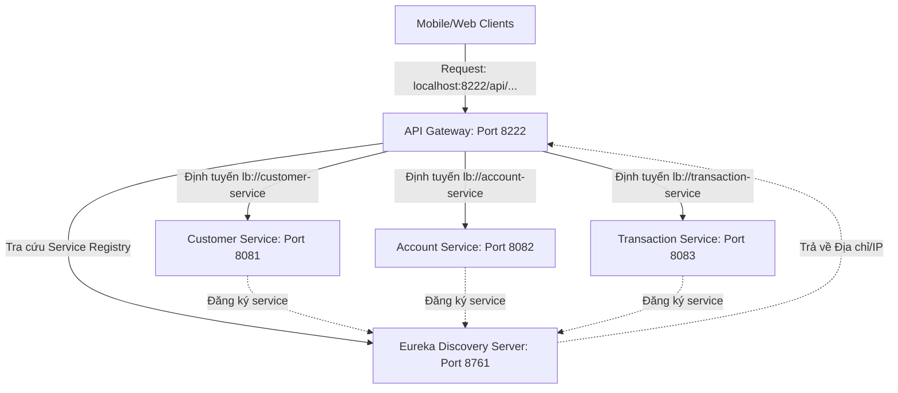

# FinBank API Gateway Microservices Architecture

Bài viết dưới đây hướng dẫn xây dựng và cấu hình **API Gateway** làm cổng vào duy nhất (Single Entry Point) cho hệ thống Microservices của FinBank sử dụng **Spring Cloud Gateway** và **Eureka Discovery Server**.

## 1. Sơ đồ Kiến trúc Hệ Thống FinBank

Dưới đây là sơ đồ kiến trúc hoạt động của luồng Request từ Client đi qua API Gateway rồi phân phối đến các Microservice tương ứng.



---

## 2. Thứ Tự Khởi Động Hệ Thống

Để hệ thống hoạt động chính xác và các service có thể đăng ký thành công lên Discovery Server, vui lòng khởi động theo thứ tự sau:

1. **Config Server** (Port `8888`): Cung cấp cấu hình tập trung (nếu có sử dụng).
2. **Eureka Discovery Server** (Port `8761`): Service registry để quản lý danh sách các microservices.
3. **Các Microservices Nghiệp Vụ** (Khởi động song song hoặc tuần tự):
   - `customer-service` (Port `8081`)
   - `account-service` (Port `8082`)
   - `transaction-service` (Port `8083`)
4. **API Gateway** (Port `8222`): Điểm truy cập duy nhất điều phối request.

---

## 3. Hướng Dẫn Kiểm Thử Bằng Postman

Thay vì gọi trực tiếp tới các port lẻ tẻ (`8081`, `8082`, `8083`), tất cả request của Client từ nay sẽ đi qua Port **`8222`**:

### 3.1. Truy vấn thông tin khách hàng (Customer Service)
- **HTTP Method**: `GET`
- **Gateway URL**: `http://localhost:8222/api/customers/1`
- **Luồng xử lý**: Gateway nhận request -> đối chiếu Route với path `/api/customers/**` -> chuyển tiếp request đến một instance của `customer-service` đang chạy trên port `8081` qua cơ chế Load Balancing (`lb://customer-service`).

### 3.2. Tạo mới tài khoản (Account Service)
- **HTTP Method**: `POST`
- **Gateway URL**: `http://localhost:8222/api/accounts`
- **Body JSON**:
  ```json
  {
    "customerId": 1,
    "accountType": "SAVINGS",
    "balance": 5000000
  }
  ```
- **Luồng xử lý**: Định tuyến tới `account-service` (Port `8082`).

### 3.3. Thực hiện chuyển tiền (Transaction Service)
- **HTTP Method**: `POST`
- **Gateway URL**: `http://localhost:8222/api/transactions`
- **Body JSON**:
  ```json
  {
    "sourceAccountId": 1,
    "targetAccountId": 2,
    "amount": 250000
  }
  ```
- **Luồng xử lý**: Định tuyến tới `transaction-service` (Port `8083`).